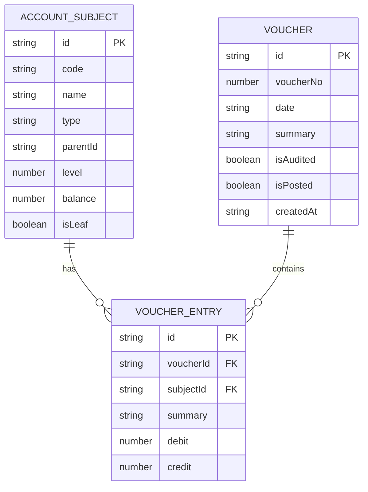

## 1. Architecture Design

```mermaid
graph TB
    subgraph "Desktop App
        subgraph "Electron Main Process
            A[Electron 主进程]
            B[文件系统API]
            C[自动保存服务]
        end
        subgraph "Renderer Process"
            D[React 前端界面]
            E[React Router 路由]
            F[Zustand 状态管理]
        end
    end
    subgraph "数据存储
        G[(SQLite 数据库文件]
        H[(JSON 备份文件]
    end
    A &lt;--&gt; B
    A &lt;--&gt; C
    B &lt;--&gt; G
    B &lt;--&gt; H
    A &lt;--&gt; D
    D --&gt; E
    D --&gt; F
```

## 2. Technology Description
- **跨平台框架: Electron@28
- **前端**: React@18 + TypeScript + Vite
- **UI框架**: Tailwind CSS + shadcn/ui
- **状态管理**: Zustand
- **路由**: React Router v6
- **数据库**: better-sqlite3
- **数据备份**: JSON文件
- **初始化工具: vite-electron-builder

## 3. Route Definitions
| Route | Purpose |
|-------|---------|
| / | 首页 - 数据概览和快捷操作 |
| /subjects | 科目管理 - 科目列表和编辑 |
| /vouchers | 凭证管理 - 凭证列表和录入 |
| /ledgers | 账簿查询 - 明细账和总账 |
| /reports | 报表管理 - 各类报表生成 |
| /settings | 系统管理 - 备份恢复和设置 |

## 4. Data Model

### 4.1 Data Model Definition



### 4.2 Data Initialization
初始会计科目表:
- 1001 库存现金
- 1002 银行存款
- 2001 党费收入
- 2002 上级补助收入
- 3001 党费使用
- 3002 其他支出

## 5. Core Module Design

### 5.1 Database Module
使用 better-sqlite3 进行本地数据存储，支持事务操作。

### 5.2 Auto-save Service
定时自动保存数据到SQLite数据库，支持自定义保存间隔。

### 5.3 Backup/Restore
支持导出JSON格式备份文件，可恢复数据。
